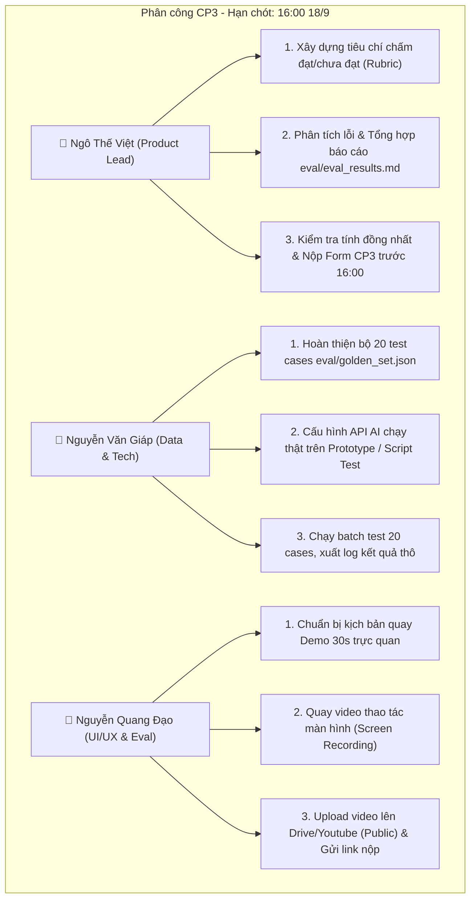

# CP3 · Kế hoạch triển khai & Phân công nhiệm vụ nhóm BaConSau

> **Dự án:** Trợ lý Học tập Thích ứng theo phương pháp "Học từ lỗi sai" (VLearn Error-Driven Active Learning)  
> **Nhóm:** BaConSau — **Lớp:** 3B — **Phòng:** E402 — **Cụm:** C4  
> **Track:** D2 · Học từ lỗi trước - làm bài rồi mới được giảng  
> **Hạn nộp:** **16:00 · 18/9** (Đội trưởng nộp form đại diện nhóm)  
> **Điểm số:** **5 điểm** (Nộp đúng hạn = đạt, muộn = 0 điểm)

---

## 1. Mục tiêu & Tiêu chí đạt của CP3

| Tiêu chí | Yêu cầu bắt buộc | Lưu ý quan trọng |
|---|---|---|
| **Mục đích** | Chứng minh sản phẩm **chạy thật (có gọi AI thật)** và có **số đo thực tế** (biết sản phẩm đúng/sai đến đâu). | Không nói suông "chạy tốt", cần có con số cụ thể kèm phân tích. |
| **Sản phẩm 1** | **Video thao tác (~30 giây):** Quay màn hình thao tác thật trên sản phẩm, thấy rõ AI trả kết quả thật. | Quay thô/ngắn gọn, không cần dựng hiệu ứng. Bắt buộc có ≥1 lời gọi AI thật. |
| **Sản phẩm 2** | **Số đo kiểm thử (Eval Metrics):** Chạy thử bộ kiểm thử (~15–20 câu), đếm tỷ lệ đạt chuẩn. | *"Số xấu vẫn được đủ điểm — miễn là số thật"*. Phân tích rõ nguyên nhân các ca bị lỗi. |

---

## 2. Phân công nhiệm vụ chi tiết từng thành viên



### 👤 1. Ngô Thế Việt (Product Lead)
* **Nhiệm vụ chính:**
  1. **Thiết lập Rubric đánh giá:** Định nghĩa rõ ràng 3 tiêu chuẩn cốt lõi:
     - *Không spoil:* AI không đưa code giải/đáp án hoàn chỉnh ngay.
     - *Đúng định hướng:* Chỉ ra đúng loại lỗi (Misconception hoặc Transfer Failure) và gợi ý nấc thang phù hợp.
     - *Dẫn nguồn chuẩn:* Trích dẫn đúng slide/kiến thức liên quan trong bài giảng.
  2. **Tổng hợp báo cáo đánh giá:** Hoàn thiện file [eval/eval_results.md](file:///d:/Vin_AI/K4-3B-E402-BaConSau/eval/eval_results.md) ghi nhận kết quả đo lường, phân loại tỷ lệ Đạt/Chưa đạt và phân tích nguyên nhân các ca lỗi (hallucination, gợi ý quá dài, lộ từ khóa...).
  3. **Nộp bài:** Điền Form nộp CP3 của BTC trước 16:00 bằng đúng mã học viên đã nộp ở CP1 & CP2.

### 👤 2. Nguyễn Văn Giáp (Data & Tech Lead)
* **Nhiệm vụ chính:**
  1. **Xây dựng bộ Golden Set kiểm thử:** Tạo file [eval/golden_set.json](file:///d:/Vin_AI/K4-3B-E402-BaConSau/eval/golden_set.json) gồm **20 test cases** bao phủ các nhóm:
     - 7 ca *Ngộ nhận khái niệm (Misconception)*.
     - 8 ca *Tắc nghẽn chuyển giao (Transfer Failure)*.
     - 3 ca *Làm đúng hoàn toàn (Happy Path -> Kích hoạt Reverse-Probing)*.
     - 2 ca *Cố tình xin đáp án / Prompt Injection (Guardrails)*.
  2. **Đảm bảo AI chạy thật:** Tích hợp API key và gọi trực tiếp LLM (OpenAI / Gemini / Claude) trong codebase hoặc script kiểm thử tự động.
  3. **Chạy kiểm thử & Xuất log:** Chạy lần lượt 20 cases, ghi nhận phản hồi thực tế từ AI và bàn giao dữ liệu thô cho Product Lead phân tích.

### 👤 3. Nguyễn Quang Đạo (UI/UX & Validation)
* **Nhiệm vụ chính:**
  1. **Soạn kịch bản quay video 30 giây:**
     - Giây 00–05: Mở bài tập chẩn đoán (Diagnostic Challenge) trên giao diện web.
     - Giây 06–15: Nhập câu trả lời kèm lập luận sai (ví dụ ngộ nhận stateless) và bấm "Nộp bài & Kiểm tra".
     - Giây 16–25: Hiển thị loading gọi AI thật và AI trả về phản hồi Scaffolding Hint (Nấc 1: Chỉ ra tiền đề sai + Nấc 2: Trích nguồn slide).
     - Giây 26–30: Học viên click "Thử sửa lại" chứng minh vòng lặp tự sửa sai hoạt động.
  2. **Thực hiện quay màn hình:** Dùng OBS / Clipchamp / Windows Game Bar quay video rõ nét 1080p, định dạng `.mp4`.
  3. **Lưu trữ & Chia sẻ:** Upload video lên Google Drive (mở quyền *"Bất kỳ ai có liên kết đều có thể xem"*) hoặc YouTube Unlisted, cung cấp link cho Lead.

---

## 3. Khung cấu trúc dữ liệu nộp (Artifacts & File Mapping)

```
K4-3B-E402-BaConSau/
├── CP3.md                      # [FILE NÀY] Kế hoạch & Phân công CP3
├── Canvas.md                   # Canvas 7 dòng (CP1)
├── flow-cp2.md                 # Sơ đồ luồng (CP2)
├── codebase/
│   ├── index.html              # Giao diện Web Prototype
│   ├── app.js                  # Logic gọi AI & tương tác
│   └── style.css               # Styling UI
└── eval/
    ├── README.md               # Giới thiệu thư mục Eval
    ├── golden_set.json         # 20 ca kiểm thử thực tế (Input, Ground-truth, Lỗi)
    └── eval_results.md         # Bảng đo lường thực tế (Ví dụ: Đạt 15/20 = 75%)
```

---

## 4. Timeline chi tiết trước giờ G (16:00 · 18/9)

| Thời gian | Đầu việc | Người chịu trách nhiệm | Trạng thái cần đạt |
|---|---|---|---|
| **11:30 – 13:30** | Hoàn thành `golden_set.json` (20 cases) & chuẩn bị API gọi AI | Văn Giáp | File JSON hoàn chỉnh trong `eval/` |
| **13:30 – 14:30** | Chạy kiểm thử toàn bộ 20 cases qua AI, ghi nhận log | Văn Giáp + Thế Việt | Có đủ 20 kết quả thô |
| **14:30 – 15:15** | Đánh giá số đo, phân tích nguyên nhân lỗi, viết `eval_results.md` | Thế Việt | Hoàn tất file báo cáo số đo |
| **14:30 – 15:15** | Quay video thao tác 30s trên UI có AI chạy thật & Upload Drive | Quang Đạo | Có link video xem được trực tiếp |
| **15:15 – 15:40** | Cả nhóm rà soát chéo (kiểm tra link video + số đo eval) | Cả nhóm | Không bị lỗi phân quyền link |
| **15:40 – 15:55** | **Đội trưởng nộp Form CP3** | Thế Việt | Xác nhận Form submitted thành công |

---

## 5. Mẫu nội dung số đo (Tham khảo điền Form CP3)

```text
[Tóm tắt số đo CP3 - BaConSau - Track D2]:
- Tổng số test cases kiểm thử: 20 cases (7 Misconception, 8 Transfer Failure, 3 Happy Path, 2 Anti-Spoil).
- Kết quả đo lường thực tế: 15/20 cases đạt chuẩn (Tỷ lệ: 75.0%).
- Phân tích 5 ca chưa đạt:
  + 2 ca: AI gợi ý hơi dài, vô tình chứa từ khóa đáp án (cần tinh chỉnh prompt siết chặt token).
  + 2 ca: Trích dẫn slide chưa đúng trang trọng tâm.
  + 1 ca: Guardrail từ chối hơi cứng nhắc khi học viên hỏi câu hỏi mở.
- Link Video thao tác 30s (AI chạy thật): [ĐIỀN LINK DRIVE / YOUTUBE TẠI ĐÂY]
- Link Thư mục Eval (GitHub): https://github.com/TheViet298/K4-3B-E402-BaConSau/tree/main/eval
```
