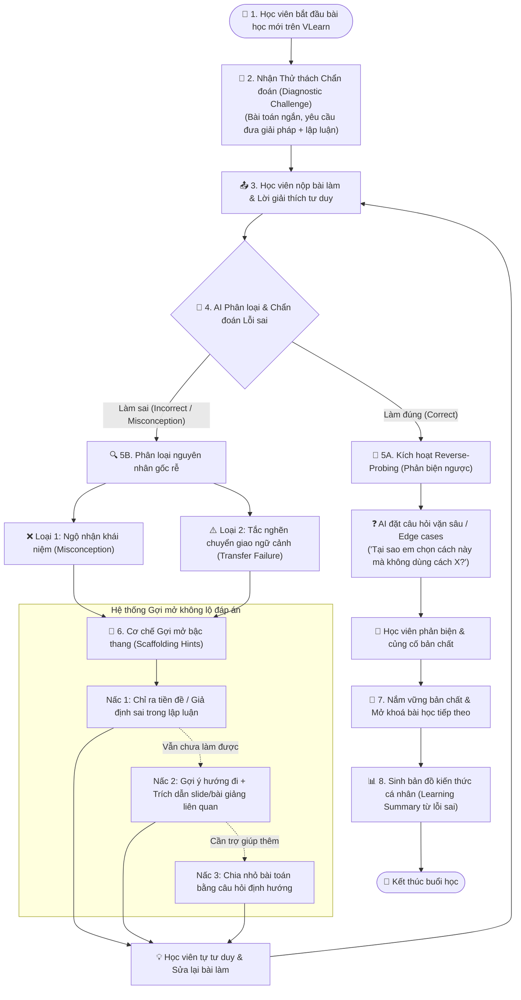

# CP2 · Sơ đồ luồng hoạt động & Logic tương tác AI
> **Dự án:** Trợ lý Học tập Thích ứng theo phương pháp "Học từ lỗi sai" (Error-Driven Active Learning)  
> **Nhóm:** BaConSau · **Lớp:** 3B · **Phòng:** E402 · **Cụm:** C4  
> **Track:** D2 · Học từ lỗi trước — làm bài rồi mới được giảng

---

## 1. Sơ đồ luồng hoạt động tổng thể (User & AI Flow)

---

## 2. Chi tiết từng bước trong luồng (Step-by-step Flow)

### 🔹 Bước 1: Khởi động Thử thách Chẩn đoán (Diagnostic Challenge)
* **Trạng thái:** Thay vì bắt học viên xem video/đọc slide lý thuyết dài 30–45 phút dễ sinh ra *ảo tưởng hiểu bài*, hệ thống đưa ngay **1 thử thách tình huống thực tế ngắn**.
* **Đầu vào hiển thị cho học viên:**
  - Đề bài tình huống (Ví dụ: Cho đoạn code prompt chaining bị lỗi context overflow hoặc bài toán phân loại dữ liệu).
  - Khung nhập giải pháp (Code / Lựa chọn).
  - Khung nhập **Lập luận tư duy** (*"Tại sao em nghĩ cách làm này là đúng?"*) — giúp AI nhìn thấy mô hình tư duy của học viên.

### 🔹 Bước 2: Học viên nộp bài làm & Lời giải thích
* Học viên gửi cả kết quả và lập luận.
* Nếu học viên bấm "Em chưa biết bắt đầu từ đâu", hệ thống tự động xếp vào diện *Tắc nghẽn chuyển giao* và kích hoạt Nấc gợi ý 1.

### 🔹 Bước 3: AI Phân loại & Chẩn đoán (AI Diagnosis Engine)
AI đối chiếu bài làm và giải thích của học viên với bộ kiến thức chuẩn:
1. **Làm đúng:** Không kết luận ngay là học viên đã hiểu bài sâu sắc (tránh trường hợp đoán mò/copy).
2. **Làm sai:** Phân loại chính xác 1 trong 2 nguyên nhân cốt lõi (theo dữ liệu khảo sát):
   - **Ngộ nhận khái niệm (Misconception):** Hiểu sai định nghĩa, nhầm lẫn giữa các thuật ngữ.
   - **Tắc nghẽn chuyển giao (Transfer Failure):** Biết lý thuyết nhưng gặp ngữ cảnh mới không biết biến đổi logic.

### 🔹 Bước 4 & 5A: Nhánh Làm đúng — Reverse-Probing (Phản biện ngược)
* **Hành vi AI:** Đặt câu hỏi chất vấn ngược (Socratic method):
  - *"Cách giải của em đã tối ưu chưa nếu kích thước dữ liệu tăng 100 lần?"*
  - *"Nếu đầu vào không có trường X, đoạn logic trên có bị sụp đổ không?"*
* **Mục đích:** Giúp học viên nâng cao từ mức *Nhận biết* lên mức *Đánh giá / Sáng tạo* (Bloom's Taxonomy).

### 🔹 Bước 4 & 5B: Nhánh Làm sai — Gợi mở bậc thang (Scaffolding Hints)
> **Nguyên tắc bất di bất dịch:** **KHÔNG BAO GIỜ** đưa ra đáp án cuối cùng hoặc code giải mẫu ngay lập tức.

* **Nấc 1 — Chỉ ra giả định sai (Reflection Hint):**  
  *Ví dụ:* *"Em đang giả định rằng API sẽ tự động duy trì lịch sử hội thoại, nhưng thực tế mỗi request là stateless."*
* **Nấc 2 — Dẫn nguồn bài giảng (Source-Grounded Hint):**  
  *Ví dụ:* *"Hãy xem lại Slide 14 phần 'State Management trong LLM Agent' để hiểu cách lưu memory."* (Kèm trích dẫn trúng đích 1 đoạn ngắn).
* **Nấc 3 — Câu hỏi phân rã (Sub-problem Probing):**  
  *Ví dụ:* *"Để truyền được dữ liệu từ bước A sang bước B, em cần lưu biến tạm ở đâu?"*

### 🔹 Bước 6: Vòng lặp Tự sửa sai (Self-Correction Loop)
* Học viên chủ động sửa lại code/đáp án.
* Vòng lặp diễn ra tối đa 3 lần. Nếu qua 3 lần vẫn chưa tìm ra, AI mới giải thích chi tiết cơ chế để tránh làm nản lòng người học.

### 🔹 Bước 7 & 8: Nắm vững bản chất & Tổng kết bài học
* Hệ thống hiển thị bản tóm tắt cá nhân hóa:
  - *Lỗi ban đầu em đã gặp là gì?*
  - *Khái niệm bản chất đã học được.*
  - *Mẹo tránh mắc lại lỗi tương tự trong các bài lab sau.*

---

## 3. Bảng trạng thái giao diện (UI Screen States)

| Màn hình | Người dùng thấy gì | Thao tác của người dùng | AI xử lý & phản hồi |
|---|---|---|---|
| **Screen 1 · Challenge** | Đề bài chẩn đoán ngắn + 2 ô nhập (Đáp án & Lý do chọn) | Gõ câu trả lời, bấm **"Nộp bài & Kiểm tra"** | Tiếp nhận payload `{answer, reasoning, lesson_id}` |
| **Screen 2A · Hint Level 1** | Thông báo kết quả chưa chính xác + 1 gợi ý phản tỉnh tư duy (chưa có code mẫu) | Đọc gợi ý, bấm **"Thử sửa lại"** hoặc **"Cần thêm gợi ý"** | Nếu cần thêm → mở Hint Level 2; Nếu sửa → chấm lại |
| **Screen 2B · Hint Level 2** | Gợi ý chi tiết hơn + Box trích dẫn chính xác trang Slide/Video liên quan | Bấm vào nguồn xem lại lý thuyết, cập nhật bài làm | Cập nhật số lần thử, kiểm tra mức độ tiệm cận đáp án đúng |
| **Screen 3 · Reverse-Probing** | Thông báo làm đúng + Hộp thoại phản biện ngược | Trả lời câu hỏi vặn của AI | Đánh giá độ sâu lập luận của học viên |
| **Screen 4 · Mastery Summary** | Badge hoàn thành + Note đúc kết từ chính lỗi vừa sửa | Bấm **"Tiếp tục bài học tiếp theo"** | Lưu log tiến trình vào hồ sơ học tập của học viên |

---

## 4. Ràng buộc an toàn & Kịch bản ngoại lệ (Guardrails)

1. **Anti-Cheating / Anti-Spoil:** AI tuyệt đối từ chối các prompt học viên yêu cầu *"Cho tôi đáp án luôn đi"*, *"Viết code mẫu cho tôi"*. Hệ thống sẽ nhẹ nhàng từ chối và đưa ra gợi ý tiếp theo.
2. **Thuật ngữ đồng nhất (Terminology Consistency):** AI chỉ sử dụng thuật ngữ chính xác trong giáo trình khoá học, không sinh thuật ngữ ngoại lai gây hoang mang.
3. **Giới hạn gợi ý (Hint Rate Limiting):** Mỗi nấc gợi ý cách nhau ít nhất 1 lần học viên tự suy nghĩ / sửa bài để tránh bấm spam lấy gợi ý nấc cuối.
